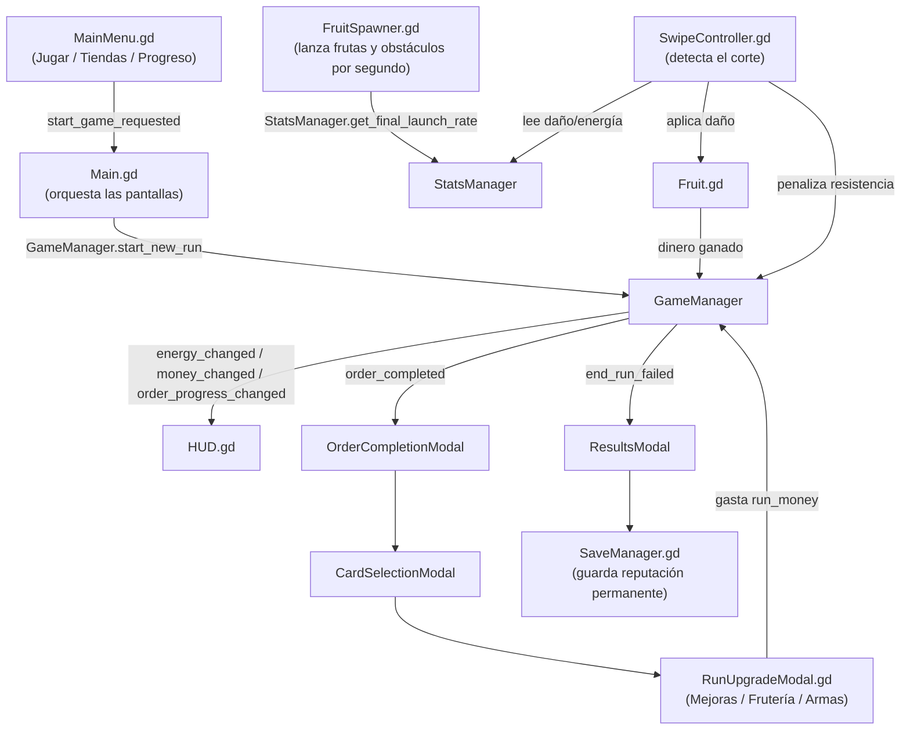

# Guía del Proyecto (Fruit MVP)

Esta guía explica cómo está organizado el proyecto y **qué archivo editar**
para cambiar cada parte del juego. Está pensada para alguien que recién
empieza a tocar el código.

> Nota: este documento es solo una guía de orientación. No cambia nada del
> juego por sí mismo; los valores reales de balance siguen viviendo en los
> archivos `.gd` mencionados.

---

## 1. Estructura de carpetas

```
fruit-mvp/
├── project.godot          # Configuración del proyecto y lista de Autoloads
├── scenes/                # Escenas de Godot (.tscn) - la "forma" visual
│   ├── Main.tscn          # Escena raíz: agrupa menú, juego y todos los modales
│   ├── game/               # Escenas de gameplay (fruta, cortador, spawner, texto flotante)
│   └── ui/                 # Escenas de interfaz (HUD, menús, tiendas, modales)
├── scripts/                # Todo el código GDScript
│   ├── autoload/            # Singletons globales (ver sección 3)
│   ├── models/               # Tablas de datos / catálogos (frutas, cartas, cuchillos)
│   ├── game/                 # Lógica de la jugabilidad (frutas, corte, spawner)
│   ├── ui/                   # Lógica de cada pantalla/modal
│   └── Main.gd                # Orquesta qué pantalla se muestra y cuándo
└── resources/               # Iconos e imágenes (cards, fruits, knives)
```

La carpeta ya estaba bien organizada por tipo de archivo (autoload / models /
game / ui), así que no se movió ni renombró nada: solo se añadieron
comentarios explicativos.

---

## 2. ¿Qué archivo edito para cambiar...?

| Quiero cambiar...                                            | Archivo a editar |
|---------------------------------------------------------------|-------------------|
| Vida, recompensa o probabilidad de Jackpot de una fruta | [scripts/models/FruitDatabase.gd](scripts/models/FruitDatabase.gd) |
| Daño, gasto de energía o precio de un arma                    | [scripts/autoload/StatsManager.gd](scripts/autoload/StatsManager.gd) (diccionario `knives_db`) |
| Costo/efecto de las "Mejoras" del mercado (daño, energía, suerte, dinero, frecuencia) | [scripts/autoload/StatsManager.gd](scripts/autoload/StatsManager.gd) (`run_upgrade_definitions`) |
| Costo/efecto de las mejoras permanentes de Prestigio           | [scripts/autoload/StatsManager.gd](scripts/autoload/StatsManager.gd) (`prestige_definitions`) |
| Comodines/cartas disponibles y su efecto                       | [scripts/models/CardDatabase.gd](scripts/models/CardDatabase.gd) |
| Precio de desbloqueo de cada fruta en la tienda                | [scripts/ui/RunUpgradeModal.gd](scripts/ui/RunUpgradeModal.gd) (`fruit_prices`) |
| Cuánto dinero hace falta para completar cada pedido/día         | [scripts/autoload/GameManager.gd](scripts/autoload/GameManager.gd) (`ORDER_TARGETS`) |
| Cuántos proyectiles (frutas/obstáculos) se lanzan por segundo   | [scripts/autoload/StatsManager.gd](scripts/autoload/StatsManager.gd) (`BASE_LAUNCH_RATE` + fórmulas `get_final_launch_rate()`) |
| Probabilidad/frecuencia de obstáculos (piedras) y su penalización | [scripts/autoload/StatsManager.gd](scripts/autoload/StatsManager.gd) (constantes `*_OBSTACLE_CHANCE`, `OBSTACLE_RESISTANCE_PENALTY_FRACTION`) |
| Fórmula de reputación ganada al quebrar el negocio              | [scripts/autoload/GameManager.gd](scripts/autoload/GameManager.gd) (función `end_run_failed`) |
| Textos/orden de las pantallas de Progreso                       | [scripts/ui/ProgressModal.gd](scripts/ui/ProgressModal.gd) |

---

## 3. Los 4 Autoloads (singletons globales)

Definidos en `project.godot`, accesibles desde cualquier script sin
necesidad de buscarlos en el árbol de nodos:

- **SaveManager** ([scripts/autoload/SaveManager.gd](scripts/autoload/SaveManager.gd)): progreso
  **permanente** guardado en disco (reputación, mejoras de prestigio,
  estadísticas históricas). Sobrevive aunque el negocio quiebre o se cierre
  el juego.
- **StatsManager** ([scripts/autoload/StatsManager.gd](scripts/autoload/StatsManager.gd)): catálogos
  de balance (armas, mejoras del mercado, prestigio) y las fórmulas
  `get_final_...()` que combinan todos los bonos para dar el valor final
  usado en el juego (daño, energía, dinero, etc).
- **GameManager** ([scripts/autoload/GameManager.gd](scripts/autoload/GameManager.gd)): estado de
  **la partida actual** ("el negocio"): dinero de la partida, pedido/día
  actual, energía, y qué frutas/armas se desbloquearon SOLO en esta
  partida (se pierden si el negocio quiebra). Cada ronda dura como máximo
  **1 minuto** (`ROUND_TIME_SECONDS`): al agotarse el tiempo se valida si
  se cumplió el objetivo (igual que al agotar la resistencia).
- **SoundManager** ([scripts/autoload/SoundManager.gd](scripts/autoload/SoundManager.gd)): genera los
  efectos de sonido por código. No tiene valores de balance.

---

## 4. Qué es permanente y qué es temporal (por negocio)

Esto es clave para entender el juego:

**Permanente (sobrevive a quebrar el negocio, guardado por `SaveManager`):**
- Puntos de reputación/prestigio y las mejoras de la Tienda de Prestigio.
- Estadísticas históricas (dinero total ganado, frutas cortadas, etc).
- Registro de qué frutas/armas se han descubierto **alguna vez** (solo para
  la pantalla de Progreso, no afecta lo que tienes disponible en un negocio
  nuevo).

**Temporal (se reinicia cada vez que empieza un negocio nuevo, en
`GameManager.start_new_run()` / `StatsManager.reset_run_stats()`):**
- Dinero de la partida (`GameManager.run_money`).
- Mejoras del mercado (daño, energía, suerte, dinero, frecuencia) compradas con ese dinero.
- Comodines/cartas elegidos durante la partida.
- Frutas y armas desbloqueadas/equipadas en la pestaña "Frutería"/"Armas" del
  mercado (`GameManager.run_unlocked_fruits`, `run_unlocked_knives`,
  `run_equipped_knife`).

---

## 5. Cómo se relacionan los sistemas principales



- **FruitSpawner.gd** lanza frutas (y obstáculos) desde abajo a razón de
  `StatsManager.get_final_launch_rate()` frutas por segundo (estilo Fruit
  Ninja), usando `FruitDatabase.gd` (la tabla de balance) y solo entre las
  frutas desbloqueadas en el negocio actual
  (`GameManager.get_unlocked_fruits_for_current_order`).
- **SwipeController.gd** detecta el gesto de corte y le pregunta a
  `StatsManager` cuánto daño hacer y cuánta energía gastar. Golpear un
  obstáculo llama a `GameManager.penalize_resistance()`.
- **Fruit.gd** recibe el daño, calcula si hay Jackpot, y avisa a
  `GameManager.register_fruit_cut()` para sumar el dinero ganado. El
  movimiento parabólico lo hace el componente **Ballistic.gd**.
- **RunUpgradeModal.gd** es el mercado entre pedidos: gasta
  `GameManager.run_money` y modifica el estado temporal de la partida
  (mejoras, frutas y armas desbloqueadas). La **Frutería** y la **Armería**
  están **bloqueadas en cadena**: no puedes comprar una fruta/arma sin
  haber comprado la anterior (ver `_get_prev_fruit_id` /
  `_get_prev_knife_id`).
- Al quebrar el negocio, **GameManager.end_run_failed()** calcula la
  reputación ganada y se la entrega a `SaveManager` (permanente), luego
  muestra **ResultsModal.gd**.

---

## 7. Modelo de balance (economía geométrica)

Todo el balance sigue curvas geométricas ~x1.75 para mantener un ciclo
"incremental/roguelike" coherente: retador pero no imposible.

- **Objetivos del día** (`GameManager.ORDER_TARGETS`): 30 → 1.239.500 en 20
  pedidos (x1.75 por pedido); después la fórmula sigue x1.75.
- **Premios de las frutas** (`FruitDatabase.FRUITS`): 1-10 → 114.000-340.000
  (x1.75 por fruta aprox.).
- **Vida de las frutas** (`FruitDatabase.FRUITS`): 18 → 21.000 (x1.5 las
  primeras 10, luego se aplana a ~x1.35 para que las frutas tardías se sientan
  alcanzables con mejoras de daño/armas).
- **Precios de la Frutería** (`RunUpgradeModal.fruit_prices`): cada fruta
  cuesta ~3-4 objetivos del día anterior, para que compres de a una fruta por
  tienda.
- **Reputación** (`GameManager.end_run_failed`): 10 por pedido + 1 por cada
  $50.000 generados (el dinero aporta suplementos, no la mayor parte).
- Ajusta la dificultad tocando el factor x1.75 (objetivos, premios) o el HP
  de las frutas; si una zona se siente imposible, suele haber que esperar
  mejoras de daño o el arma de esa zona.

---

## 6. Verificación

Se revisó que todas las señales, referencias `@onready` y nombres de nodos
siguen intactos después de añadir los comentarios (no se detectaron errores
de script). No se cambió ningún valor de balance, fórmula, nombre de
función/variable ni ruta de archivo/escena.

> Nota (rework Fruit Ninja): se eliminó la velocidad de las frutas, el límite
> de tiempo por pedido y las "frutas simultáneas"; ahora el juego lanza X
> frutas/obstáculos por segundo (`get_final_launch_rate()`), los críticos son
> SIEMPRE x2 sin recuperación de resistencia, y golpear obstáculos resta
> resistencia. Ver `scripts/game/Ballistic.gd`, `Obstacle.gd` y
> `StatsManager.gd` (constantes `BASE_LAUNCH_RATE`, `*_OBSTACLE_CHANCE`).
